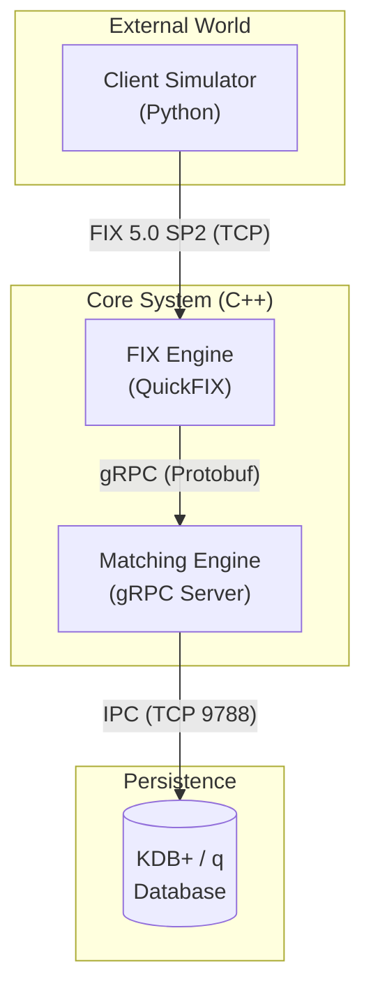

# High-Performance FIX Trading System

A comprehensive trading system simulation that demonstrates a full order lifecycle: from FIX client connectivity to order matching and trade persistence.

## 🚀 Overview

This project implements a modular trading architecture consisting of:
1.  **Client Simulator:** Simulates multiple market participants sending FIX New Order Single messages (Buy/Sell).
2.  **FIX Engine:** A gateway server that accepts FIX connections, validates messages, and forwards them internally.
3.  **Matching Engine:** The core logic that maintains order books, matches buy/sell orders, and executes trades.
4.  **Trade Database:** A KDB+ database for high-speed storage of trade execution history.

## 🏗️ Architecture

The system uses a microservices-like architecture where components communicate via standard protocols (FIX, gRPC, TCP).



### Data Flow
1.  **Order Entry:** Python clients generate FIX `NewOrderSingle` messages and send them to the **FIX Engine** via TCP.
2.  **Gateway:** The **FIX Engine** (using QuickFIX) parses the message. If valid, it converts the FIX message into a `FixOrder` Protobuf object.
3.  **Internal Routing:** The order is sent via **gRPC** to the **Matching Engine**.
4.  **Matching:** The **Matching Engine** processes the order against its internal `OrderBook`. If a match occurs (Ask <= Bid), a trade is executed.
5.  **Persistence:** Executed trades are pushed asynchronously to the **KDB+** instance via its C interface for persistent storage.

## 🛠️ Tech Stack

*   **Languages:** C++20, Python 3, Q (KDB+)
*   **Protocols:** FIX 5.0 SP2, gRPC, Protocol Buffers
*   **Libraries:**
    *   **QuickFIX:** FIX Protocol engine.
    *   **gRPC / Protobuf:** Internal service communication.
    *   **KDB+ c.o:** Interface for KDB+ communication.
*   **Build System:** CMake, Conan Package Manager.
*   **Tools:** tmux (for orchestration).

## 📋 Prerequisites

Ensure you have the following installed on your Linux system:

*   **C++ Compiler:** GCC or Clang supporting C++20.
*   **CMake:** Version 3.30.3 or higher.
*   **Conan:** C++ Package Manager.
*   **Python 3:** With `pip` installed.
*   **KDB+ (q):** Ensure `q` is in your PATH or configured correctly.
*   **tmux:** Required for the startup script to manage multiple processes.

## ⚙️ Build Instructions

The project includes helper scripts to handle the build process, including dependency resolution via Conan.

1.  **Clone the repository:**
    ```bash
    git clone <repository_url>
    cd fix_engine
    ```

2.  **Build the Release version:**
    This script handles Conan installation, CMake generation, and compilation. *Note: The initial build may take time as it builds dependencies like gRPC.*
    ```bash
    ./scripts/release_build.sh
    ```

    *Alternatively, for a debug build:*
    ```bash
    ./scripts/debug_build.sh
    ```

## 🚀 Usage

To run the entire system (Database, Matching Engine, FIX Engine, and Clients), use the provided orchestration script. This script creates a `tmux` session with separate panes for each component.

1.  **Start the System:**
    ```bash
    ./scripts/run_release_system.sh
    ```

2.  **What to Expect:**
    *   A `tmux` window will open.
    *   **Pane 1 (Database):** KDB+ server listening on port `9788`.
    *   **Pane 2 (Matching Engine):** Starts and connects to KDB+. Listens for gRPC on `0.0.0.0:9787`.
    *   **Pane 3 (FIX Engine):** Connects to Matching Engine. Accepts FIX connections.
    *   **Pane 4 (Clients):** Launches the Python client simulator to start trading.

3.  **Stopping:**
    Press `Ctrl+C` in the respective panes to stop individual components, or kill the tmux session.

## 📂 Project Structure

*   `client_simulator/`: Python scripts for generating FIX traffic.
*   `fix_engine/`: C++ QuickFIX application (Gateway).
*   `matching_engine/`: C++ Core application (Order Matching).
*   `database/`: Q scripts for KDB+ setup and schema.
*   `common/`: Shared Protobuf definitions and FIX specs.
*   `scripts/`: Shell scripts for building and running the system.
*   `vendor/`: Third-party dependencies (KDB+ headers/objs).